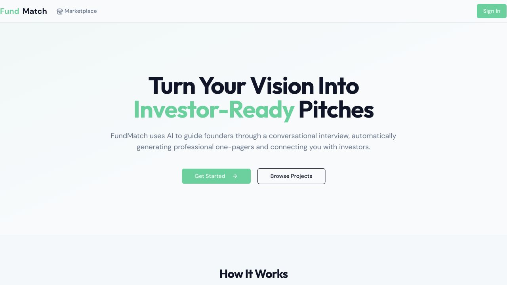
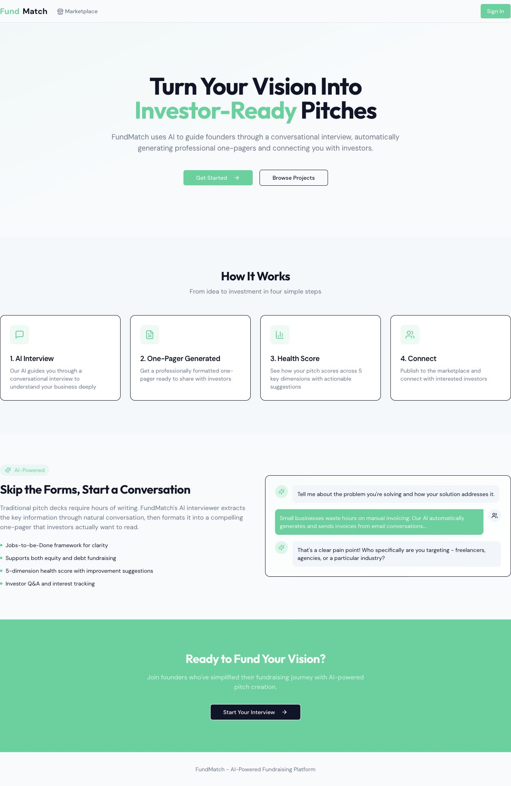
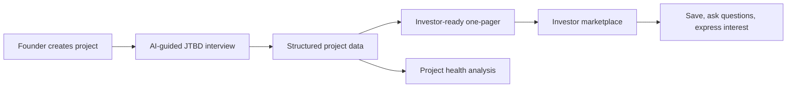

# FundMatch

**An AI-assisted fundraising marketplace prototype that helps early-stage founders turn an idea into an investor-ready narrative.**

FundMatch guides founders through a structured, conversational interview, converts their answers into a one-page investment summary, and gives investors a consistent way to discover and evaluate projects.

> Status: working prototype. Built as a product and engineering experiment with AI-assisted development on Replit.

## Product preview



<details>
<summary>View the full landing-page flow</summary>
<br />



</details>

## Product flow



The interview captures the founder's solution, target customer, goals, market context, barriers, unfair advantages, credentials, and funding needs. The application stores both the conversation and structured project fields so the resulting profile can be revised rather than treated as a one-off model response.

## What I built

- A multi-stage AI interview that tracks progress and extracts structured fundraising information.
- One-pager generation and project-health analysis using the OpenAI API.
- Founder and investor workflows, including project creation, discovery, saved projects, questions, and expressions of interest.
- Persistent authentication, sessions, conversations, projects, and marketplace interactions.
- A responsive React interface spanning landing, dashboard, project detail, preview, marketplace, saved-project, and chat views.

## Architecture

| Layer | Technology | Responsibility |
|---|---|---|
| Frontend | React, TypeScript, Vite, Tailwind CSS, shadcn/ui | Product flows, forms, dashboards, marketplace, chat |
| API | Node.js, Express, TypeScript | REST endpoints, authorization, AI orchestration, business logic |
| Data | PostgreSQL, Drizzle ORM, Zod | Typed schemas, projects, users, conversations, investor activity |
| Authentication | Replit Auth, OpenID Connect, server-side sessions | Login, user identity, protected routes |
| AI | OpenAI API | JTBD interview, structured extraction, one-pager generation, project analysis |

## Repository map

```text
client/src/          React application and reusable UI
server/              Express API, AI logic, authentication, storage
shared/              Database schemas, validation, shared API contracts
script/              Production build tooling
```

Key files:

- [`server/ai.ts`](server/ai.ts) — interview stages, model prompts, structured extraction, one-pager and health analysis.
- [`server/routes.ts`](server/routes.ts) — authenticated project, conversation, marketplace, question, and interest endpoints.
- [`shared/schema.ts`](shared/schema.ts) — typed product data model.
- [`client/src/pages/`](client/src/pages/) — founder and investor experiences.

## Run locally

Prerequisites: Node.js 20+, PostgreSQL, and the required authentication and AI environment variables.

```bash
npm install
cp .env.example .env
npm run dev
```

To preview the public product interface without configuring a database, authentication, or an AI provider:

```bash
npm install
npm run dev:ui
```

Core environment variables:

```text
DATABASE_URL
SESSION_SECRET
ISSUER_URL
REPL_ID
AI_INTEGRATIONS_OPENAI_API_KEY
AI_INTEGRATIONS_OPENAI_BASE_URL
```

Never commit real credentials. The repository contains application code only; production deployment requires separately configured database, authentication, and AI services.

## Design choices

- **Structured state over transcript-only chat:** interview answers are stored as typed project fields that can power generation, search, scoring, and editing.
- **Human-editable outputs:** the one-pager is a draft founders can refine and reuse outside the marketplace.
- **Shared contracts:** frontend and backend use common Zod and TypeScript definitions to reduce schema drift.
- **Transparent prototype scope:** AI-assisted development accelerated implementation; product definition, workflow design, review, and testing remain human responsibilities.

## Next steps

- Add automated tests for authorization, stage transitions, schema extraction, and model-response failure handling.
- Add model evaluation fixtures for extraction completeness, one-pager factuality, and prompt-injection resistance.
- Add observability for latency, token usage, extraction failures, and user drop-off by interview stage.
- Add founder-controlled redaction and stronger safeguards for sensitive company information.

## Author

Cara Li — HBS MBA candidate and former Product Manager on Zhipu AI's LLM research team, with experience in AI data acquisition, model evaluation, GUI agents, and enterprise AI partnerships.
